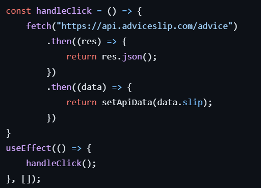

# Frontend Mentor - Advice generator app solution

This is a solution to the [Advice generator app challenge on Frontend Mentor](https://www.frontendmentor.io/challenges/advice-generator-app-QdUG-13db). 

## Overview

### The challenge

Users should be able to:

- View the optimal layout for the app depending on their device's screen size
- See hover states for all interactive elements on the page
- Generate a new piece of advice by clicking the dice icon

### Screenshot

### Links

- Solution URL: [Add solution URL here](https://www.frontendmentor.io/solutions/react-advice-generator-app-flJ_H0o-HK)
- Live Site URL: [Add live site URL here](https://jrobera.github.io/Advice-generator-app/)

## My process

### Built with
- Mobile-first workflow
- [React](https://reactjs.org/) - JS library

### What I learned
I learned fetching data from an api using useEffect hook

## Author

- Frontend Mentor - [@JRobera](https://www.frontendmentor.io/profile/JRobera)

## Setup

npm install

npm start

